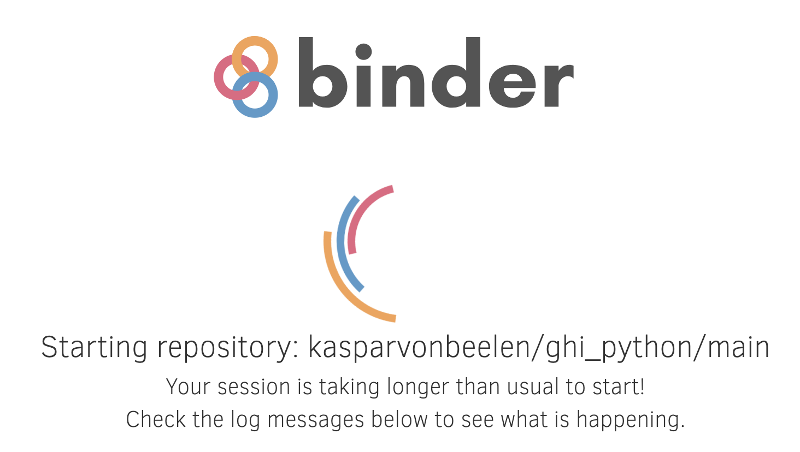

# How to use this course?

To run the Binder environment click on:
1 The Binder badge of the main page

2 A link to an individual notebook

You should see the following message appearing:

This will create the online Binder environment. It may take a while when running Binder for the first time but once it is set up, accessing other notebooks will be fast.

Have a coffee if it takes more than a minute.

After Binder is set up you should either see Jupyter Lab interface (if clicked on the binder badge)
 or the notebook.
 
 
 
 In the Jupyter Lab interface you see all the notebook listed at the left-hand side of the screen. Double click on the notebook to open it and inspect its contents.
 
 When you have a notebook open, the most important buttons are located at the top.
 
  
 
 

   Press this button (or press Shift and Enter) to execute code in Code cell.

