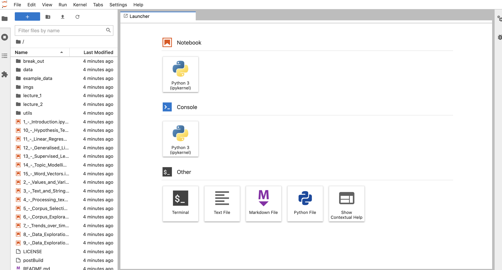

# How to access the materials of the Python course?

To run the Binder environment click on:
1 The Binder badge of the main page

2 A link to an individual notebook

You should see the following message appearing:

This will create the online Binder environment. It may take a while when running Binder for the first time but once it is set up, accessing other notebooks will be fast.

Have a coffee if it takes more than a minute.

After Binder is set up you should either see Jupyter Lab interface (if clicked on the binder badge)
 or the notebook.
 
 
 
 In the Jupyter Lab interface you see all the notebook listed at the left-hand side of the screen. Double click on the notebook to open it and inspect its contents.
 
 When you have a notebook open, the most important buttons are located at the top.
 
  
 
 
 Press this button (or press Shift and Enter) to execute code in a Code cell.

 If a process takes to long or you think you got stick in an endless loop, you can press stop to interrupt the process.

If a notebook is running, you will see the small circle at the top right turn from white to dark grey. See image below.

  If you got really stuck and nothing seems to work anymore, you can always try resetting the Kernel (this will save you time compared to relaunching binder). Press this button to reset and clean all output. You will have to reload all libraries and data in this case, if you want to continue working.

 To add a new cell to your notebook, click the "+" button. You can change to cell type from Code to Markdown, using the drop down button at the middle right. See image below.

If you observed the message "We can't seem to find the Binder page you are looking for", this means the environment you launched was inactive for too long and is remove. Please relaunch your notebook as instructed above.

